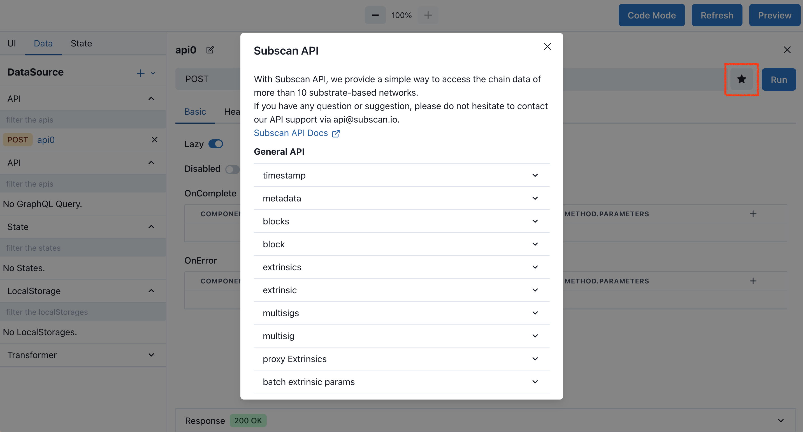
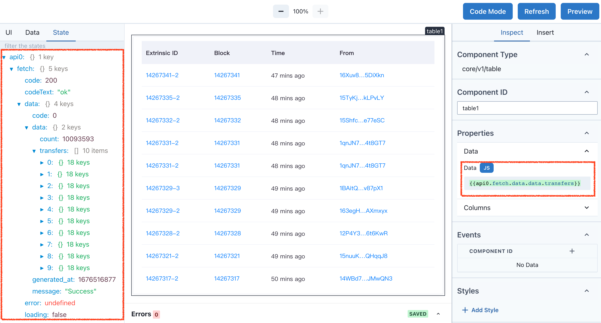

# Data Source - API Component

A visual HTTP client that easily gets data from the server.

---

## Get the latest transfer data from Polkadot Network from Subscan API

Data Source - API component can be found in the left panel `Data`, click +, select `API`, Editor creates an API named `api0` for us.

>[https://www.w3schools.com/tags/ref_httpmethods.asp](https://www.w3schools.com/tags/ref_httpmethods.asp) HTTP parameter description.

1. Editor has built-in Subscan API, which can quickly fill in the API parameters. Click the `star icon` to the left of `RUN`, select `transfers`, this API is the interface to get transfer data. The default API does not contain the request domain name, we supplement `https://polkadot.webapi.subscan.io` in the API address signature, making it complete `https://polkadot.webapi.subscan.io/api/scan/transfers`.

> Through Subscan API, we provide a simple way to access chain data of more than 10 Substrate-based networks.
> If you have any questions or suggestions, please feel free to contact our API support at api@subscan.io.
> For more detailed instructions, please visit [Subscan API](https://support.subscan.io/#introduction)

2. Modify the request parameters, switch to the Body Tab, and modify the Body to `{{{"row": 10,"page": 0,}}}`, indicating that the first page of data is requested, 10 data per page. Click RUN, check the result in Response, `200 OK` indicates that the data is successfully obtained.

## Use Table component to display data

In the component chapter, the data used in our examples are mostly static data, the data is manually entered in Data, now with the API component, you can input the API data into various style components,

The left panel State Tab shows the data shared by Editor, which can be read by each component, providing great convenience for interaction between components. As shown in the figure, `api0` is the data obtained by using the API component in step one, transfers has ten data, click on one of the data, you can see the specific content of the transfer, `from` `to` `amount` `fee` `block_num` and so on.

Add Table component in Canvas, in Inspect Tab, delete the built-in test data Data, use the expression `{{api0.fetch.data.data.transfers}}` to load `api0` data, now Table data is not fixed, every time you refresh the page, it is real-time data.

