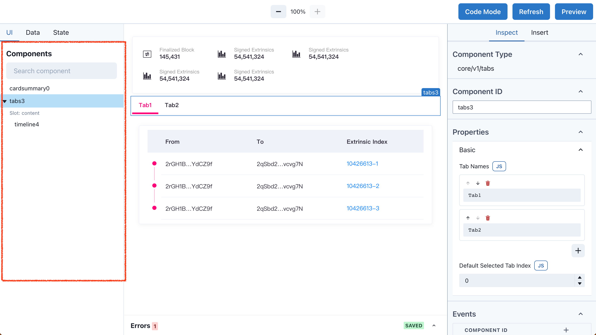
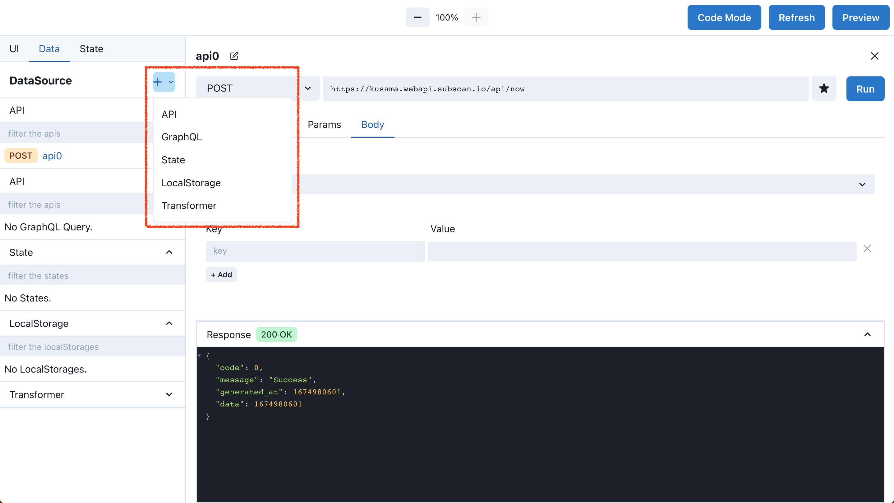
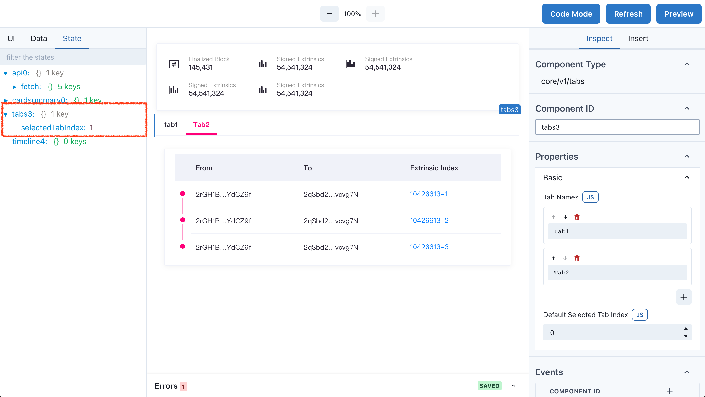
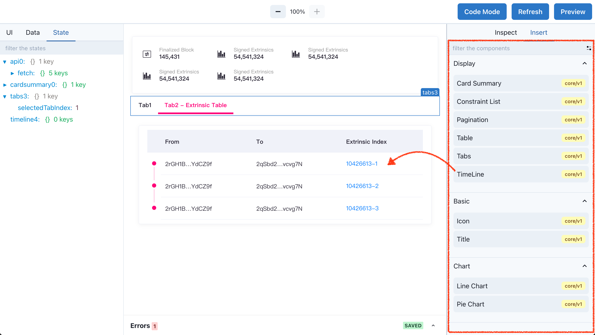

# Widget Editor

Widget Editor is a user interface for building Widgets, which consists of five modules:

- Middle panel (Canvas) - Place components to build your Widget
- Left panel - component explorer, api, app state
- Right panel - component repository, Configure your component
- Top panel - Configure widget settings
- Bottom panel - Error console

## Middle panel (Canvas)

The Canvas area is the main area for building Widgets. You can drag components from the Insert tab in the Right panel to the canvas, which are responsive layouts that automatically adapt to the screen size.

### Arrange components

To rearrange the components on the canvas, drag and drop them. Newly added components will automatically be placed at the bottom of the canvas. It is not possible to rearrange components that are already placed on the canvas using drag and drop. If you wish to rearrange components, you can do so in the Left panel - UI.

> To quickly delete a component, select it on the canvas and press `delete`.

## Left panel

The Left panel contains UI, Data and State tabs, providing a visual component tree structure for widgets.

### UI tab

The UI tab allows you to view and interact with components. The component tree structure allows for a clear view of all the components of the widget. You can drag components to rearrange or delete them.

Some components act as containers, such as Tabs. The content of Tabs is a Slot where you can drag and drop other components as child components to achieve more complex interactions.

### Data tab

The Data tab manages all the data sources of the Widget, including API, GraphQL, State, LocalStorage, Transformer. You can add any one or more of these data sources. In the figure below, an API data source is added. In the list, you can see that `api0` is a `POST` request. Select `api0` to view and edit this API request, modify the URL, Params, Body, etc. After successfully configuring api0, you can use `{{api0.fetch.data}}`, `{{api0.fetch.loading}}` to get the return result of api0. The usage of expressions will be explained in detail in the later tutorials.

### State tab

The State tab shows the state of all modules in the current Widget, such as api return values or component settings. State is equivalent to global variables in programming. Components and dataSources within the Widget can access State values. For example, `{{ tabs3.selectedTabIndex }}` gets the index property of the tabs3 component, the return value is Number, the tab selected is tab2, so the index is 1 (starting from 0).

## Right panel

Right panel 包含 Inspect 和 Insert tabs. 新增component 和 编辑 component 配置都在这个 panel.

### Inspect tab

During the process of building a widget, the Inspect tab is the panel with the most interaction. First, select the component that needs to be configured in the Canvas, and Inspect will display all the settings of the selected component (Component Type, Components ID, Properites, Events ...). Modify the settings in Inspect, and Canvas will render the new settings in real time.

In the example, we make a small modification to the Tab Names in Properies, changing Tab2 to Tab2 - Extrinsic Table, and the name of the Tab in Canvas also changes accordingly.

### Insert tab

The Insert tab is a repository that contains all the components. Drag and drop the component from this tab to the Canvas to add a new component to the Widget. Each Component contains a `core/v1` identifier, where `core` indicates the type and `v1` indicates the version. As the Widget Editor continues to develop, the Component will gradually increase, and different versions of the same component will also exist. You can quickly find the component you want through the search box at the top.

