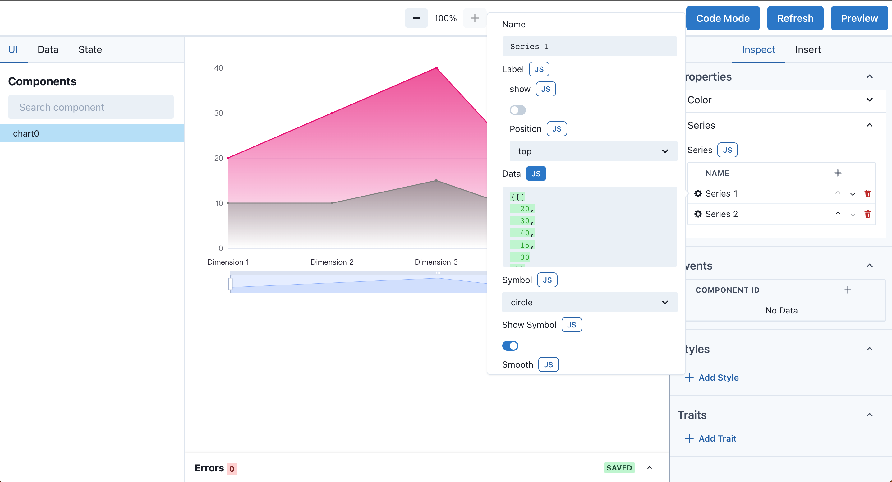

# Line Chart Component

Use charts to vividly display your data.

---

Chart series components can display data in a visual way, based on [Echarts](https://echarts.apache.org/), so you can find more usage instructions and parameter documentation on the Echarts official website.

## Example

---

## XAxis

The x-axis in the rectangular coordinate system grid, in general, a single grid component can only place up to two x-axes, more than two x-axes in the same position will cause overlap.

### Type

The type of the coordinate axis.

Optional:

- 'value' Numeric axis, suitable for continuous data.
- 'category' Category axis, suitable for discrete category data. For this type, category data can be automatically taken from series.data, or category data can be set through xAxis.data.

### Data

Category data, valid in category axis (type: 'category').

### Position

The position of the x-axis. Optional: `'top'` `'bottom'`

By default, the first x-axis in the grid is at the bottom of the grid ('bottom'), and the second x-axis is placed on the other side depending on the position of the first x-axis.

---

## YAxis

The y-axis in the rectangular coordinate system grid, in general, a single grid component can only place up to two y-axes, more than two y-axes in the same position will cause overlap.

### Type

The type of the coordinate axis.
Optional:

- 'value' Numeric axis, suitable for continuous data.
- 'category' Category axis, suitable for discrete category data. For this type, category data can be automatically taken from series.data, or category data can be set through yAxis.data.

### Data

Category data, valid in category axis (type: 'category').

### Position

The position of the y-axis. Optional: `'left'` `'right'`

By default, the first y-axis in the grid is on the left side of the grid ('left'), and the second y-axis is placed on the other side depending on the position of the first y-axis.

---

# Color

The color palette color list. If the series does not set the color, it will cycle through this list to take the color as the series color. The default is the network theme color.

Supported color formats:

- Use RGB to represent colors, such as 'rgb(128, 128, 128)', if you want to add an alpha channel to indicate opacity, you can use RGBA, such as 'rgba(128, 128, 128, 0.5)', you can also use hexadecimal format, such as '#ccc'.

---

## Series

### Name

Series name

### Label

The text label on the graphic, which can be used to explain some data information of the graphic, such as value, name, etc.

**show** - Whether to show the label.
**position** - The position of the label. Support: top / left / right / bottom / inside / insideLeft / insideRight / insideTop / insideBottom / insideTopLeft / insideBottomLeft / insideTopRight / insideBottomRight

### Data

The data source of the chart is set in Properties - Series - Data, and the data is filled in the form of a list by default. If the data source comes from the API, click the `js` button on the right side of the Data title, switch to the expression mode, and load the data dynamically through something like `{{api0.fetch.data}}`.

### Symbol

The shape of the mark. The provided mark types include `'circle'`, `'rect'`, `'roundRect'`, `'triangle'`, `'diamond'`, `'pin'`, `'arrow'`, `'none'`

### Show Symbol

Whether to show symbol, if false then only show when tooltip hover.

### Smooth

Whether to smooth the curve display, indicating whether to enable smooth processing.

### Active Area Style

The area fill style. Set to display as an area chart.

---
