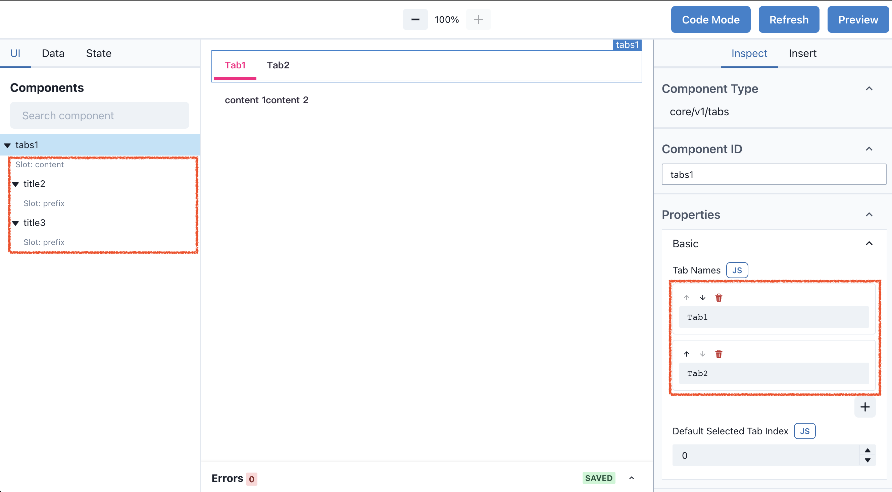

# Tabs component

Separate content sets that are related but belong to different categories.

---

## Create a basic and simple tab

Tabs component can manage data of different categories well, switch different tabs, and display different data content.

Add Tabs component, in the left panel, it is easy to find that Tabs component and Title component are the same, containing `Slot` slot, you can drag other components to the slot, become Tabs' subcomponents. Add two Title components, the content is `content 1`, `content 2` respectively, and drag them to the slot of Tabs component.



To control the display and hide of `content 1`, `content 2`, you need to use a new feature `Trait`. Select `content 1`, find Traits under Inspect, you will see `core/v1/slot` train by default, `ifCondition` value is `true`, indicating to display self component, value is `false` indicating to hide self component.

> Trait is essentially a function. The role of Trait is to increase the ability of Component. If you still use object-oriented to make an analogy, Trait is the decorator of Component. For example, add style, add state, etc. to Component.

Tabs component passes the current active Tab Index to all subcomponents, for example, when `Tab1` is selected, Tabs passes the value of `$slot.tabIndex` as `0` to the subcomponents, when `Tab2` is selected, it passes the value of `$slot.tabIndex` as `1` to the subcomponents. You can use expressions in `ifCondition` to judge the value of `$slot.tabIndex`, control display and hide. `content 1` sets `ifCondition` to `{{$slot.tabIndex === 0}}`, indicating that only when the value passed by the parent component is `0`, display self. `content 1` sets `ifCondition` to `{{$slot.tabIndex === 1}}`, now switch tabs.


## Code

``` json
{
  "version": "widget/v1",
  "kind": "Application",
  "metadata": {
    "name": "subscan widget"
  },
  "spec": {
    "components": [
      {
        "id": "tabs1",
        "type": "core/v1/tabs",
        "properties": {
          "tabNames": [
            "Tab1",
            "Tab2"
          ],
          "initialSelectedTabIndex": 0
        },
        "traits": []
      },
      {
        "id": "title2",
        "type": "core/v1/title",
        "properties": {
          "text": "content 1"
        },
        "traits": [
          {
            "type": "core/v1/slot",
            "properties": {
              "container": {
                "id": "tabs1",
                "slot": "content"
              },
              "ifCondition": "{{$slot.tabIndex === 0}}"
            }
          }
        ]
      },
      {
        "id": "title3",
        "type": "core/v1/title",
        "properties": {
          "text": "content 2"
        },
        "traits": [
          {
            "type": "core/v1/slot",
            "properties": {
              "container": {
                "id": "tabs1",
                "slot": "content"
              },
              "ifCondition": "{{$slot.tabIndex === 1}}"
            }
          }
        ]
      }
    ]
  }
}
```
